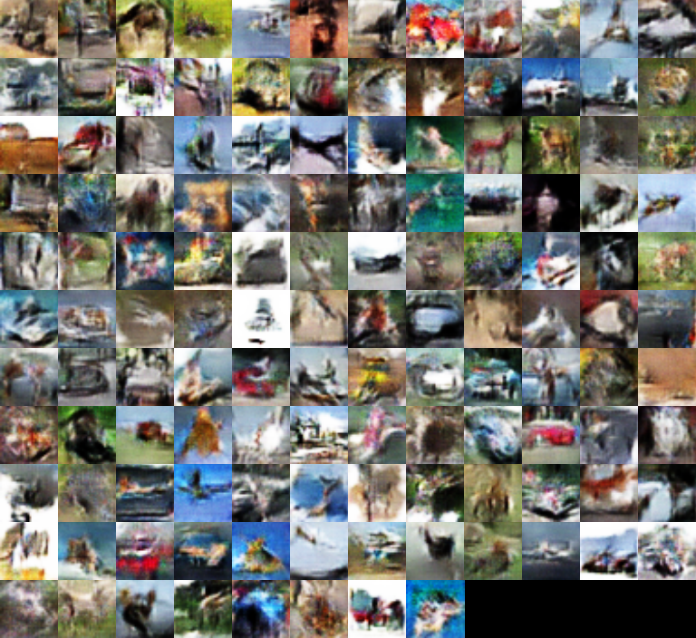
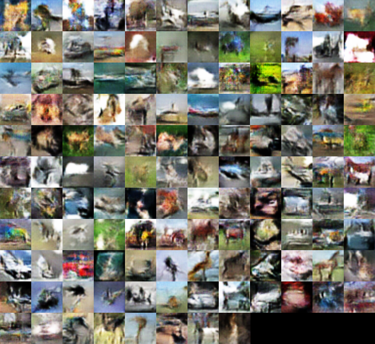
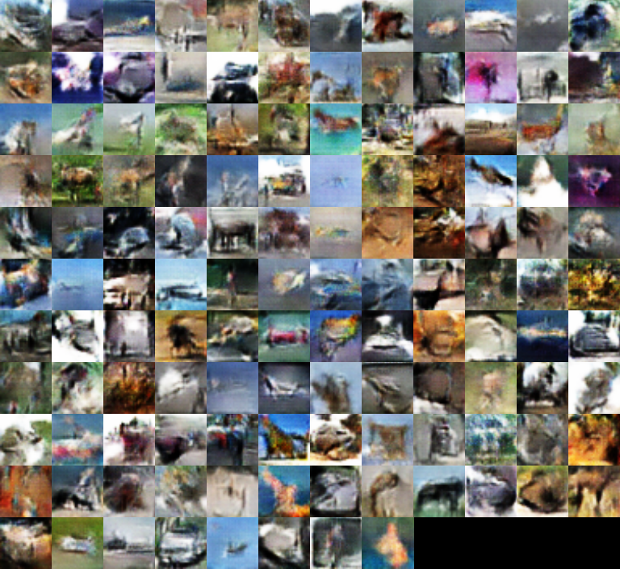
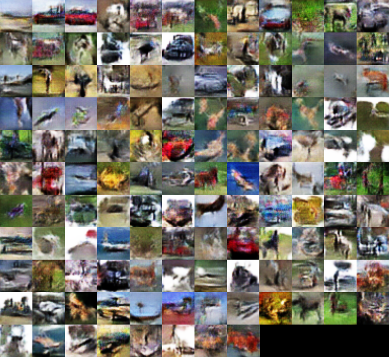

# GAN with Denoising Feature Matching

An unofficial attempt to implement the GAN proposed in [Improving Generative Adversarial Networks with Denoising Feature Matching](http://openreview.net/forum?id=S1X7nhsxl) using Chainer.

This implementation does not separately keep track of the batch normalization statistics for the discrimnator (including the feature extractor) and the denoising autoencoder for real and generated data.

The corruption function used when updating the parameters of the autoencoder is not annealed.

~~The denoising autoencoder in the original papers is trained to reconstructs corrupted images with Gaussian noise. **In this implementation the autoencoder is trained to remove the noise instead**.~~ *Edit: According to the author, this is simply a typo in the paper and the autoencoder should be trained to remove the noise as in this implementation.*

### Loss

The network is trained on 32x32 RGB images (3 channels) from CIFAR-10.

- **Discriminator Loss** Traditional discriminator GAN loss.

- **Generator Loss** Traditional generator GAN loss and reconstruction error (L2, mean squared error).

- **Denoiser Loss** Denoising autoencoder reconstruction error (L2, mean squared error).

### Samples

Generator samples after 90 to 100 epochs. See the samples directory for more images.

